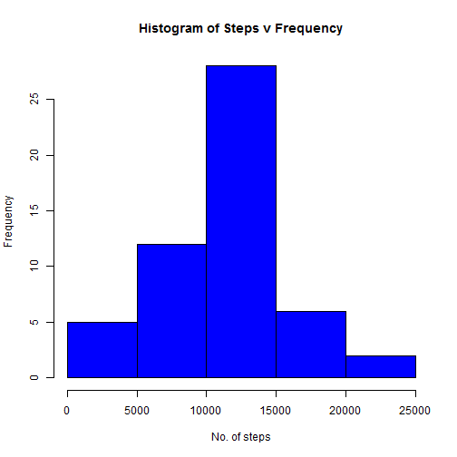
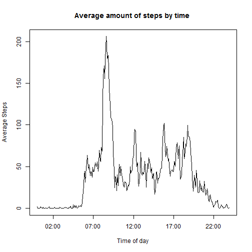
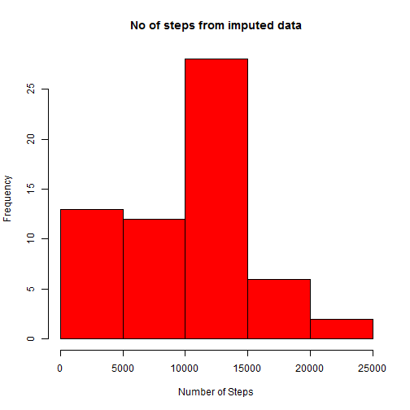

```r
setwd("C:/R/data")
options(warn = -1)      ## turn off warnings
require(dplyr)
require(ggplot2)
options(warn = 0)      ## turn on warnings


# remarked out as knitr can't process https urls

# fileurl <- "https://d396qusza40orc.cloudfront.net/repdata%2Fdata%2Factivity.zip"
# download.file(fileurl, "activity.zip")
unzip("activity.zip")  ## this unzips the file and creates a file activity.csv

RRA1data <-  read.csv("activity.csv")   # creates a data frame called RRA1data

RRA1data$date <- as.Date(as.character(RRA1data$date))  ## convert date variable from Factor to dates

RRA1data$interval <- as.character(RRA1data$interval)  # convert interval to string 

## format intervals as times prepending missing zeroes
for(i in seq_len(nrow(RRA1data)) ){
        if(nchar(RRA1data$interval[i]) == 3){
                RRA1data$interval[i] <- paste("0", RRA1data$interval[i], sep = "")}
        if(nchar(RRA1data$interval[i]) == 2){
                RRA1data$interval[i] <- paste("00", RRA1data$interval[i], sep = "")}
        if(nchar(RRA1data$interval[i]) == 1){
                RRA1data$interval[i] <- paste("000", RRA1data$interval[i], sep = "")}
}

##      Combine date and time as a timestamp
RRA1data <- mutate(RRA1data, timestamp = paste(RRA1data$date, RRA1data$interval, sep = " ") )
RRA1data$timestamp <- strptime(RRA1data$timestamp, "%Y-%m-%d %H%M")

## format the timestamp
RRA1data$timestamp <-   format(RRA1data$timestamp, "%H:%M")


# create secondary data frame of original data for Imputing missing values
RRA1data_orig <- RRA1data

good <- complete.cases(RRA1data)        # filter out the NAs

RRA1data <- RRA1data[good,]  ## 17,568 records pre-clean 15,264 records post clean

Calc_Total <- summarise(group_by(RRA1data, date), Total = sum(steps)) %>% arrange(date)

histPlot <- hist(Calc_Total$Total, xlab = "No. of steps", main = "Histogram of Steps v Frequency"
                  , col = "blue")
```

 

```r
calc_Mean <- summarise(Calc_Total, mean(Total))
Calc_median <- summarise(Calc_Total, median(Total))

l_plot_data <- summarise(group_by(RRA1data, timestamp), Mean = mean(steps))

plot(strptime(l_plot_data$timestamp, "%H:%M"), as.numeric(l_plot_data$Mean), type = "l",     xlab = "Time of day", ylab = "Average Steps", main = "Average amount of steps by time " )
```

 

```r
Time_max_steps <- l_plot_data$timestamp[l_plot_data$Mean  == max(l_plot_data$Mean)]
```

The mean value of steps for the cleaned data is 10766  
The median value of steps for the cleaned data is 10765 


```
## $breaks
## [1]     0  5000 10000 15000 20000 25000
## 
## $counts
## [1]  5 12 28  6  2
## 
## $density
## [1] 1.886792e-05 4.528302e-05 1.056604e-04 2.264151e-05 7.547170e-06
## 
## $mids
## [1]  2500  7500 12500 17500 22500
## 
## $xname
## [1] "Calc_Total$Total"
## 
## $equidist
## [1] TRUE
## 
## attr(,"class")
## [1] "histogram"
```


```r
NoGood <- !complete.cases(RRA1data_orig)        # filter out the NAs
NumNoGood <- nrow(RRA1data_orig[NoGood,])

# Missing data to be input as average per period from the day missing
Imput_dat <- summarise(group_by(RRA1data_orig, date), 
                  Avg = ifelse(is.na(mean(steps, na.rm = T)),0,mean(steps, na.rm = T)) )  %>% arrange(date)

##  The Strategy for completing missing days is to input the avg steps per period from the day data is missing

for(i in seq_len(nrow(RRA1data_orig)) ){
        if(is.na(RRA1data_orig$steps [i]) == T )
                        {
                        
                if( !is.na( Imput_dat$Avg [RRA1data_orig$date[i] == Imput_dat$date]))
                        RRA1data_orig$steps [i] <- Imput_dat$Avg [RRA1data_orig$date[i] == Imput_dat$date]
                                                }
                                        }
        # Check that all data has been cleaned up 
        #  nrow(RRA1data_orig)  == length(complete.cases(RRA1data_orig))

 Imput_Hist <- summarise(group_by(RRA1data_orig, date), NoSteps = sum(steps))
 hist(Imput_Hist$NoSteps, xlab = "Number of Steps", main = "No of steps from imputed data", col = "red")
```

 

```r
  Imput_Hist_Mn <- summarise(Imput_Hist, mean(NoSteps))
  
 Imput_Hist_Mdn <- summarise(Imput_Hist, median(NoSteps))
 
 
 
 RRA1data_orig <-  mutate(RRA1data_orig, WE = ifelse(weekdays(RRA1data_orig$date) == c("Saturday" , "Sunday"), "Weekend", "Weekday") )
 
 
 ## filter for weekends for plotting
  RRA1data_orig_WE <-  filter(RRA1data_orig, WE == "Weekend") 
  RRA1data_orig_WD <-  filter(RRA1data_orig, WE == "Weekday") 
  # take the means for the periods
  weekend_plot_data <-  summarise(group_by(RRA1data_orig_WE, timestamp), Mean = mean(steps))
  weekday_plot_data <-  summarise(group_by(RRA1data_orig_WD, timestamp), Mean = mean(steps))
  
fin_plot <-  qplot(strptime( weekend_plot_data$timestamp, "%H:%M"),weekend_plot_data$Mean, geom = "line", geom_line(aes(group=1), colour="#00099"), xlab = "Time of day", ylab = "Steps per 5 min interval", main = "Steps per day on the weekend") 
```
After imputation of the data:  
- the mean is 9354  
- the median is 10395  
  
  This has resulted in a reduction of the mean steps a day of  1412 while the median has reduced by  370 steps.
  
  

